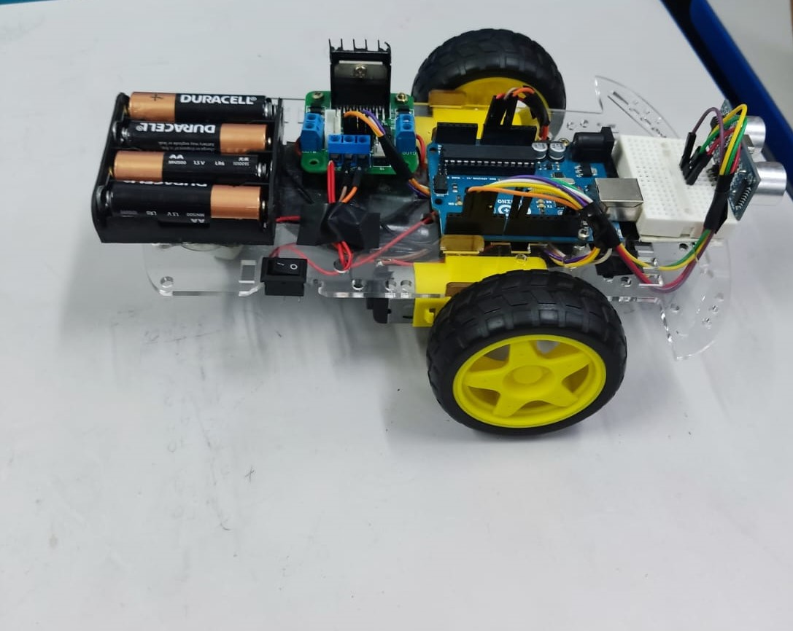

# Arduino Robot

Carrinho robô autônomo programado via Arduino para desviar de obstáculos.

## Descrição

Este é um projeto de um carrinho robô autônomo programado via Arduino para desviar de obstáculos. Ele utiliza um sensor ultrassônico para detectar a presença de obstáculos e desviar deles automaticamente.

## Funcionalidades Principais

- Movimento para frente e para trás.
- Desvio automático de obstáculos.
- Controle simples e intuitivo.

## Componentes Necessários

Para montar este projeto, você precisará dos seguintes componentes:

- Placa Arduino Uno (ou compatível).
- Sensor ultrassônico HC-SR04.
- Conjunto de motores e driver de motor.
- Bateria para alimentação.

## Instalação e Configuração

1. **Montagem do Hardware:**
   - Conecte os componentes de acordo com o esquema de circuito fornecido.
   
2. **Carregamento do Código:**
   - Abra o arquivo `robot.ino` na IDE do Arduino.
   - Selecione a placa correta (Arduino Uno) e a porta serial correta.
   - Carregue o código para a placa Arduino.

3. **Teste do Robô:**
   - Alimente o robô com a bateria.
   - Observe-o desviar de obstáculos automaticamente.